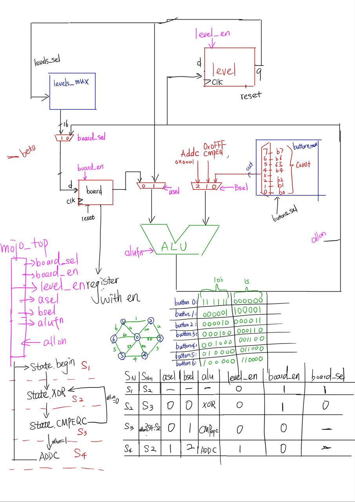
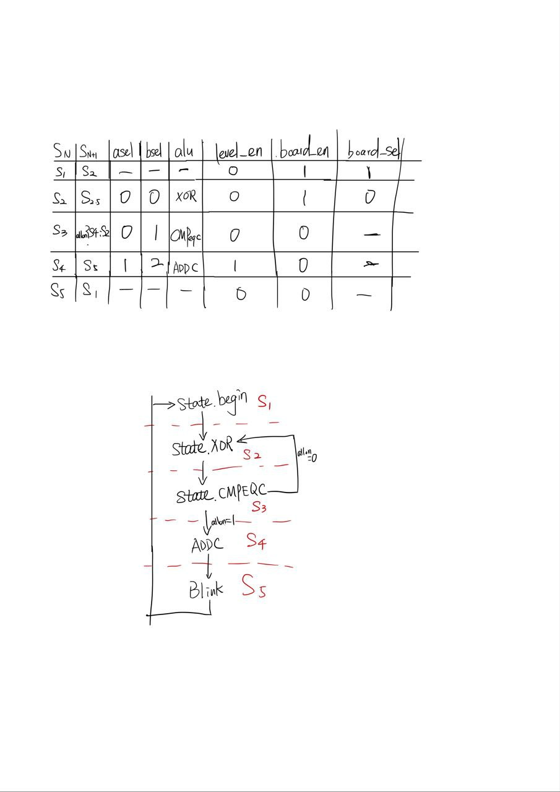

# lights-on
Game Lights-on using mojo for Computation Structure 1D at SUTD ISTD term4.

## Circuit Digram
Each color indicates that the input and output for a paricular mojo.

see [our report](https://www.overleaf.com/3435394429gffrctvghkpn) on detailed circuit diagram explanation and the details of toggle button.

## Transition Diagram

## Test cases
[our report](https://www.overleaf.com/3435394429gffrctvghkpn) in test case scenarios
